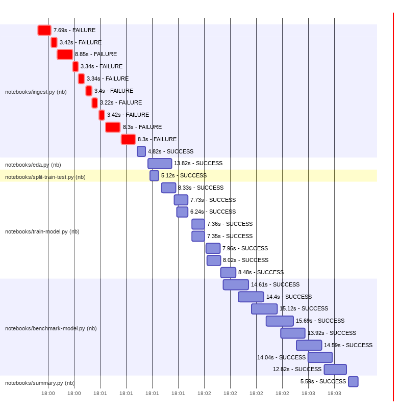

# `mnist-digits-demo-pipeline`

This repository contains a demo machine learning pipeline that trains a model for predicting digits 0, ..., 9 from a handwritten image of the digit.

The ML training pipeline is sceduled to run daily using Github actions, but does not require any other cloud infrastructure. Ie., the pipeline runs serverless using only services from a (free) personal Github account:
 - Github Actions: orchestration and compute
 - Github Build Artifacts: persisting pipeline run results (using the OpenTelemetry open standard)
 - Github Pages: static website for model/experiment tracking, [demo site](https://pynb-dag-runner.github.io/mnist-digits-demo-pipeline/). This is built using custom fork of MLFlow.

 For more details about this setup, please see the [pynb-dag-runner main repo](https://github.com/pynb-dag-runner/pynb-dag-runner) (MIT).

### ML pipeline tasks


The pipeline is implemented using the `pynb-dag-runner` library, see [here](https://github.com/pynb-dag-runner/pynb-dag-runner). Each task in the pipeline is implemented as a Jupyter Python notebook.

This repository is configured to run the pipeline for all pull requests, see experiment tracking site linked above. Alternatively, a pipeline's full output, can be inspected by downloading a zip build artefact for a recent build, [link](https://github.com/pynb-dag-runner/mnist-digits-demo-pipeline/actions/workflows/ci.yml). The zip files contain rendered notebooks, logged metrics and images and the trained model(s) in ONNX format.

## Ways to run the pipeline
### (1) Run as part of repo's automated CI pipeline

This repository uses Github Actions automation to run the demo pipeline as part of the repo's CI-pipeline. Each CI-run stores the pipeline outputs (ie notebooks, models, and logged images and metrics) as build artefacts.

This means:
- The entire pipeline is run for all commits to pull request to this repository, and to commits to `development` branch.
- From the build artefacts one can inspect the pipeline's outputs (and, in particular, model performances) for each pull request and commit.
- The pipeline runs using (free) compute resources provided by Github. No other infrastructure is needed.
- Cloning this repo gives a new pipeline with its own experiment tracker that can be developed independently.

The below diagram shows a Gantt chart with runtimes of individual pipeline tasks.



Of note:
- Tasks are run in parallel using all available cores. On (free) Github hosted runners there are two vCPUs. Parallel execution is implemented using the [Ray](https://www.ray.io/) framework.
- The first ingestion task is retried until it succeeds (and to test error handling, the ingestion step is implemented to randomly fail or hang). This explains the failures (in red) in the above Gantt chart.

### (2) Run pipeline as script (in Docker)

To run the pipeline (eg. locally) one needs to install git, make and Docker.

First, clone the demo pipeline repository
```bash
git clone --recurse-submodules git@github.com:pynb-dag-runner/mnist-digits-demo-pipeline.git
```

Now the pipeline can be run as follows:
```bash
make docker-build-all
make clean
make RUN_ENVIRONMENT="dev" test-and-run-pipeline
```

Pipeline outputs (evaluated notebooks, models, logs, and images) are stored in the repo `pipeline-outputs` directory).

This above steps are essentially what is run by the CI-automation (although that is run with `RUN_ENVIRONMENT="ci"` which is slightly slower).

### (3) Pipeline development setup

This repo is set up for pipeline development using Jupyter notebook via VS Code's remote containers. This is similar to the setup for developing the [pynb-dag-runner](https://github.com/pynb-dag-runner/pynb-dag-runner) library.

The list of development tasks in VS Code, are defined [here](workspace/.vscode/tasks.json). The key task is `mnist-demo-pipeline - watch and run all tasks` which runs the entire pipeline in watch mode, and runs black and mypy static code analysis on the pipeline notebook codes (also in watch mode).

## Contributions and contact

A motivation for this work is to make it easier to set up and work together on (open data) pipelines.

If you would like to discuss an idea or have a question, please raise an [issue](https://github.com/pynb-dag-runner/mnist-digits-demo-pipeline/issues) or contact me via email.

This is WIP and any ideas/feedback are welcome.

## License

(c) Matias Dahl 2021-2022, MIT, see [LICENSE.md](./LICENSE.md).

The training data is a reduced version of the mnist digits data in sklearn, see [sklearn documentation](https://scikit-learn.org/stable/modules/generated/sklearn.datasets.load_digits.html).
